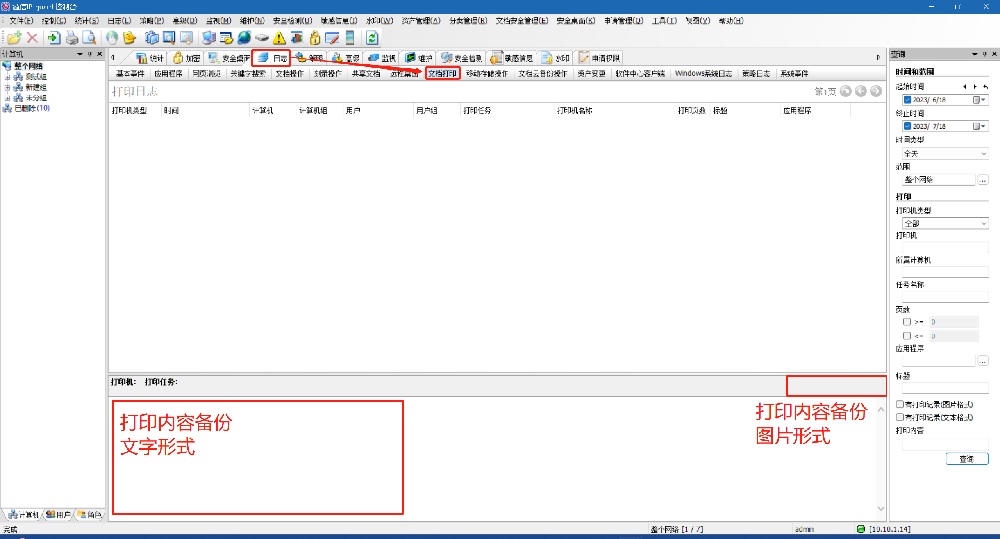

# 🔐 文档透明加密模块操作

加密模块UI说明

### 在控制台主页上有三个部分可以用于设置和加密相关的策略和配置

#### 客户端加密权限设置位置

<figure><figcaption>
此处设置客户端策略
</figcaption></figure>

#### 加密基础设置、加密相关日志及扫描加解密功能

<figure><figcaption>
此处进入文档安全的整体管理
</figcaption></figure>

#### 解密审批流程设置

<figure><figcaption>
此处进入审批流程设置
</figcaption></figure>

<figure><figcaption>
此处设置审批账户
</figcaption></figure>

## 客户端加密权限设置

<figure><figcaption>
策略设置位置
</figcaption></figure>

### 常规设置

#### 赋予直接解密权限，并可限制直接解密数量和范围

<figure><figcaption></figcaption></figure>

#### 申请解密权限可以限制申请的文件类型及文件安全区域

<figure><figcaption></figcaption></figure>

#### 申请外发文件可以限制外发时的权限基准

<figure><figcaption></figcaption></figure>

#### 直接外发文件也可限制外发时的权限基准

<figure><figcaption></figcaption></figure>

#### 允许提取已转换成OEAX外发格式内的文件

<figure><figcaption></figcaption></figure>

#### 允许申请或直接修改文档属性（修改文件安全区域）

<figure><figcaption></figcaption></figure>

#### 允许登录审批管理平台，只有登陆了审批管理平台才能执行审批解密申请等动作

<figure><figcaption></figcaption></figure>

***

### 授权软件设置

#### 授权软件分为三种操作系统对应不同的授权软件，windows支持四种加密模式，四种权限限制

<figure><figcaption></figcaption></figure>


需要注意的是：禁止截屏后，任何<mark style="color:red;">已打开的授权软件</mark>均会导致截屏时黑屏；禁止复制粘贴后，仅是禁止了授权软件到<mark style="color:red;">非授权软件</mark>之间的复制粘贴，授权软件之间的复制粘贴还是正常的。



四种加密模式：

自动加解密（windows/mac/linux）授权软件编辑保存文件后都会自动加密上，加密文件类型为授权库中的文件类型

智能加解密（windows/mac）只支持office文件，不含PDF，文件不会因保存动作而加密，同时也能打开加密文件，自己产生的及原来是明文的文件编辑保存后也依旧是明文状态

只读加密（windows）只支持office文件、PDF文件、图片文件，如字面意思，对加密文件只有只读的权限，打开后无法修改无法保存，自己也不会产生任何加密文件

只解密不加密（windows/mac/linux）与自动加解密相反，编辑保存文件后都会自动解密，只要是能打开的加密文件编辑保存后都会解密，一般给高层领导使用


`授权库制作方式`

***

### 安全区域设置&文档默认安全属性

#### 安全区域分为横向和纵向两个方向，如图左侧为横向，可自己设置，右侧为纵向，系统设置

<figure><figcaption></figcaption></figure>

***

### 文档默认属性

#### 文档属性分为<mark style="color:red;">**设置权限**</mark>和<mark style="color:red;">**访问权限**</mark>



指该文档的以下权限：

【<mark style="color:orange;">**解密文档**</mark><mark style="color:red;">**(**</mark>[<mark style="color:red;">**需拥有解密权限**</mark>](wen-dang-tou-ming-jia-mi-mo-kuai-cao-zuo.md#fu-yu-zhi-jie-jie-mi-quan-xian-bing-ke-xian-zhi-zhi-jie-jie-mi-shu-liang-he-fan-wei)<mark style="color:red;">**)**</mark>】

【<mark style="color:orange;">**更改文档安全属性**</mark><mark style="color:red;">**(**</mark>[<mark style="color:red;">**需拥有对应权限**</mark>](wen-dang-tou-ming-jia-mi-mo-kuai-cao-zuo.md#yun-xu-shen-qing-huo-zhi-jie-xiu-gai-wen-dang-shu-xing-xiu-gai-wen-jian-an-quan-qu-yu)<mark style="color:red;">**)**</mark>】

【<mark style="color:orange;">**分发文档权限到用户**</mark>】

只有在[安全区域中设置](wen-dang-tou-ming-jia-mi-mo-kuai-cao-zuo.md#an-quan-qu-yu-she-zhi-wen-dang-mo-ren-an-quan-shu-xing)了为对应安全区域权限的人员<mark style="color:red;">才能操作设置权限为对应安全区域的文档</mark>



指该文档的以下权限：

【读取】

【修改】

【拷贝】

【删除】

可供哪些人员操作，例如访问权限中有 【公共】-【普通】 则所有加密域内的用户都可以正常使用该文档，若提升为 【公共】-【机密】 则只有机密权限的人员能够查阅和使用该文档



#### 文档属性设置策略演示

如图所示，需要先创建对应的**安全区域**，安全区域可以理解为一个独立的加密区间，其中对应属性的加密文件需要有对应加密区间的权限才可以打开


同一个<mark style="color:red;">**计算机**</mark>可以归属于<mark style="color:red;">**多个加密区间**</mark>

同一个<mark style="color:red;">**文件**</mark>只能归属于<mark style="color:red;">**一个加密区间**</mark>


<figure><figcaption></figcaption></figure>

如图所示，策略是从上往下匹配的，对终端上产生的 txt文本文件 加密时赋予【公共】-【普通】权限；对终端上产生的 pdf文件 加密时赋予【财务部】-【普通】权限；

<figure><figcaption>
此时即使序号2加上*.txt，最终产生的txt加密文件也是公共+普通
</figcaption></figure>

同一个加密区间内，可以有不同的加密等级，加密等级从低到高分列


同样的，同一个<mark style="color:red;">**计算机**</mark>可以属于<mark style="color:red;">**多个不同加密区间的多个等级**</mark>（如存在同一区间内的多个等级，取最高等级）

同一个<mark style="color:red;">**文件**</mark>只能属于<mark style="color:red;">**一个加密区间的单个等级**</mark>


<figure><figcaption></figcaption></figure>


一般不建议把属性搞得太复杂，不然系统后期运维工作量巨大


***

## 加密后端基础设置、加密相关日志及扫描加解密功能

<figure><figcaption>
策略设置位置
</figcaption></figure>

### 授权软件

