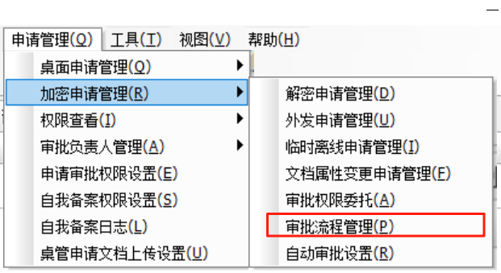

# 🔐 文档透明加密模块操作

加密模块UI说明

在控制台主页上有三个部分可以用于设置和加密相关的策略和配置

1. 客户端加密权限设置位置

<figure><figcaption>
此处设置客户端策略
</figcaption></figure>

2. 加密基础设置、加密相关日志及扫描加解密功能

<figure><figcaption>
此处进入文档安全的整体管理
</figcaption></figure>

3. 解密审批流程设置

<figure><figcaption>
此处进入审批流程设置
</figcaption></figure>

<figure><figcaption>
此处设置审批账户
</figcaption></figure>

## 客户端加密权限设置

1. 赋予直接解密权限，并可限制直接解密数量和范围

<figure><figcaption></figcaption></figure>

2. 申请解密权限可以限制申请的文件类型及文件安全区域

<figure><figcaption></figcaption></figure>

3. 申请外发文件可以限制外发时的权限基准

<figure><figcaption></figcaption></figure>

4. 直接外发文件也可限制外发时的权限基准

<figure><figcaption></figcaption></figure>

5. 允许提取已转换成OEAX外发格式内的文件

<figure><figcaption></figcaption></figure>

6. 允许申请或直接修改文档属性（修改文件安全区域）

